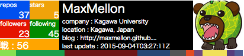

# GithubSignature



## About

`Githubsignature` is can be embedded the signature in HTML.

## Installation

```
$ wget https://raw.githubusercontent.com/MaxMEllon/GithubSignature/master/build/styles/github_signature.css
$ wget https://raw.githubusercontent.com/MaxMEllon/GithubSignature/master/build/scripts/github_signature.js
```

## Requirements

- [React.js](http://facebook.github.io/react/) >= 0.13.3
- [JSXTransformaer](https://fb.me/JSXTransformer-0.13.2.js)
- [JQuery](https://code.jquery.com/jquery-2.1.3.min.js)
- [Github.api](https://api.github.com)

## Usage

```html
  <head>
    <link href="path/to/github_signature.css">
  </head>
  <body>
    <div id="github-signature"></div>
    <script src="https://code.jquery.com/jquery-2.1.3.min.js"></script>
    <script src="https://fb.me/react-0.13.3.js"></script>
    <script src="https://fb.me/JSXTransformer-0.13.2.js"></script>
    <script src="path/to/github_signature.js"></script>
    <script src="https://cdnjs.cloudflare.com/ajax/libs/marked/0.3.2/marked.min.js"</script>
    <script>
      github = new Github()
      github.getUserData('[username]')
    </script>
  </body>
```

## Contact

[](https://gitter.im/MaxMEllon/GithubSignature?utm_source=badge&utm_medium=badge&utm_campaign=pr-badge&utm_content=badge)

## LICENSE

This software is released under the MIT License, see LICENSE.txt.
